# StoreRate — FullStack Intern Coding Challenge

A store rating platform with a **single login for three roles** — System Administrator,
Normal User and Store Owner. Users submit ratings from 1 to 5 for stores registered on
the platform; each role sees a different application after signing in.

| Layer    | Choice                                     |
| -------- | ------------------------------------------ |
| Backend  | Express.js (ESM), raw parameterised SQL    |
| Database | PostgreSQL 16                              |
| Frontend | React 18 + Vite + React Router             |
| Auth     | JWT bearer tokens, scrypt password hashing |

---

## Screenshots

### Sign in and sign up

A single login page serves all three roles. Signup is public and always creates a
Normal User. Validation runs on blur and on submit, with live character counters for
the fields that have length limits.

| Login | Registration (with validation) |
| :---: | :---: |
| 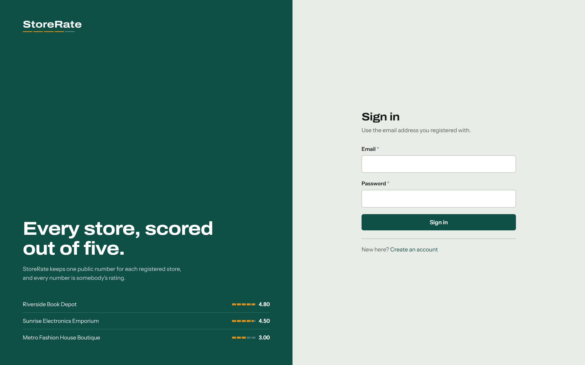 | 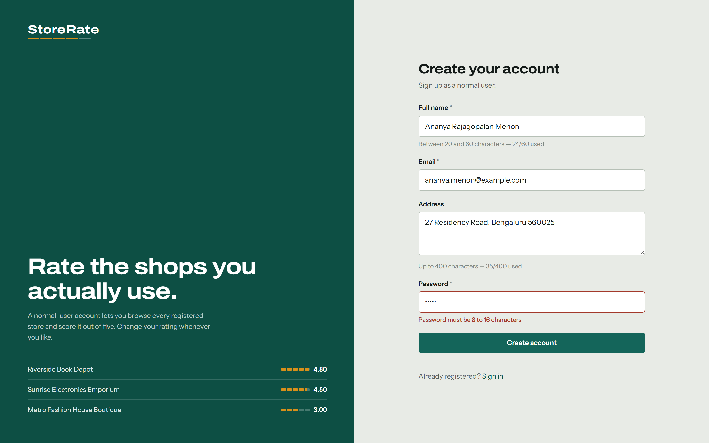 |

### System Administrator

Dashboard totals, then the user and store listings — every column sortable, every
listing filterable, and store owners carrying their rating through to the detail view.

The dashboard shows the three totals the brief asks for and nothing else. Two of them
open a listing and say so; **Total ratings** does not, because there is no ratings
listing — the asymmetry is what tells you which figures you can follow.

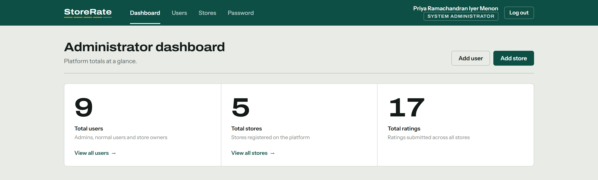

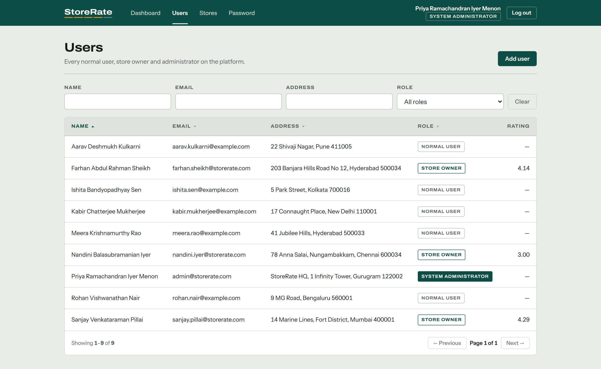

A Store Owner's detail page adds their **Rating** alongside the usual fields, broken
down by the stores they own:

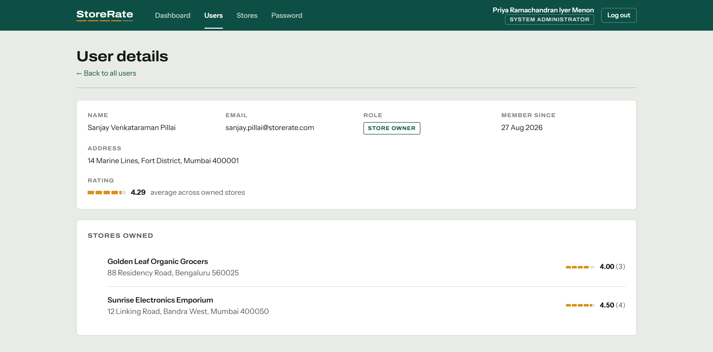

| Store listing | Add store |
| :---: | :---: |
| 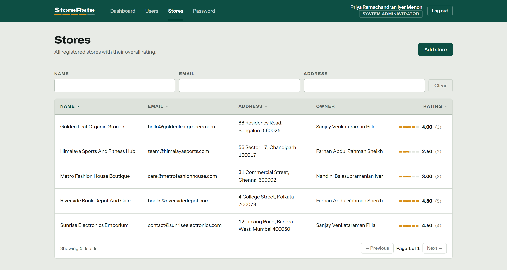 | 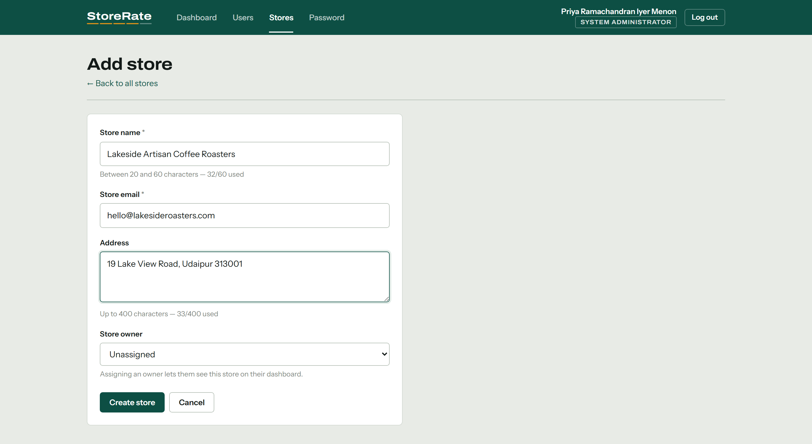 |

### Normal User

The store list shows the store's overall rating and this user's own submitted rating side
by side. Clicking a segment of the rating meter submits or modifies the rating in place —
no page reload, no separate "edit" mode.

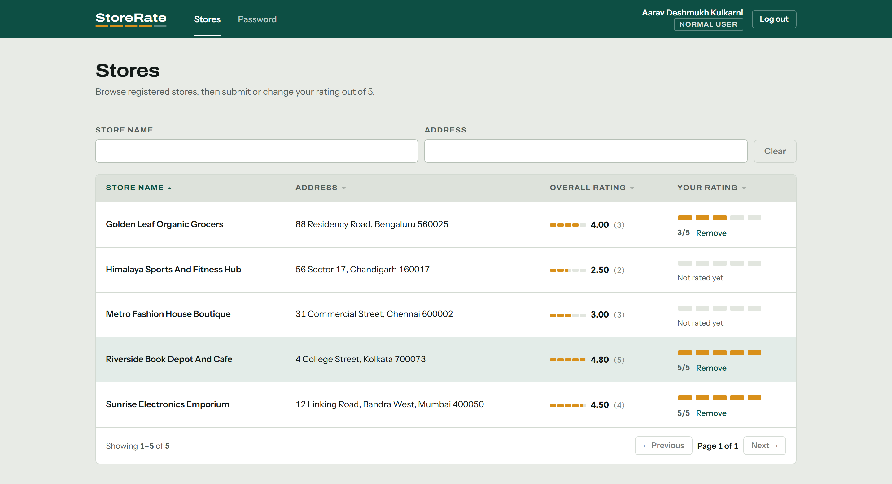

Search filters by store name and address, debounced at 300 ms:

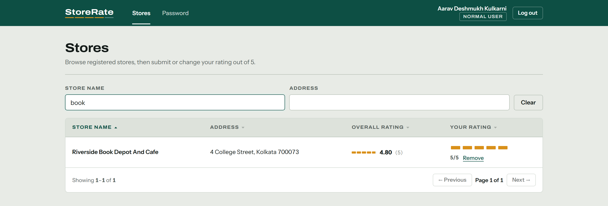

### Store Owner

Average rating across owned stores, and the list of users who submitted those ratings:

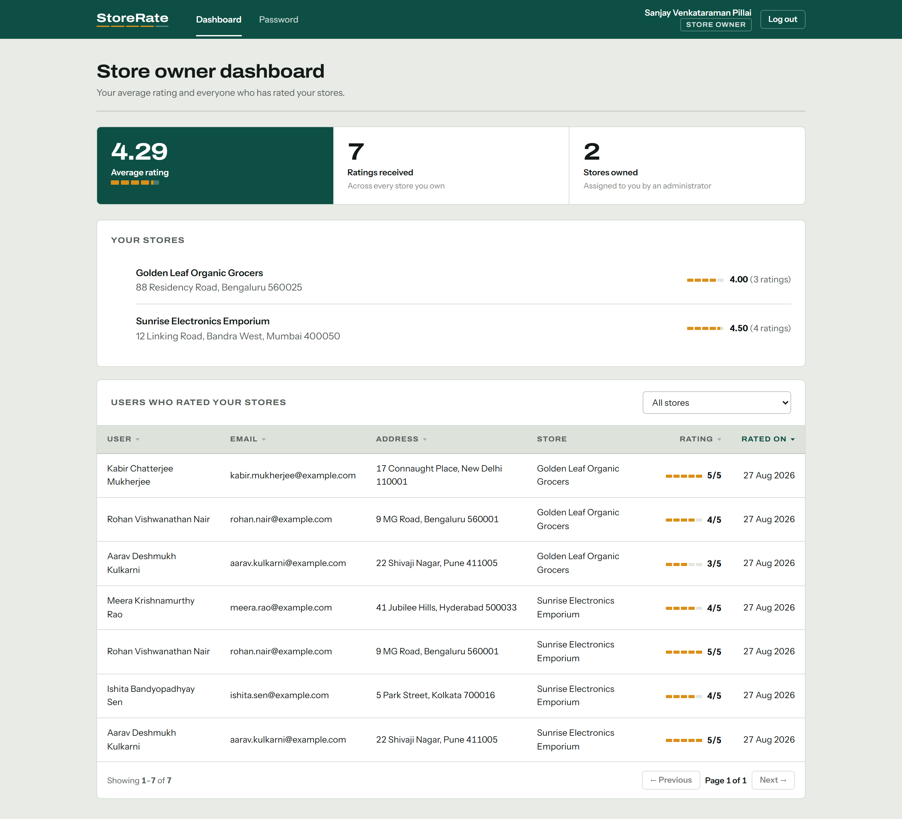

### Shared

Password update is available to all three roles:

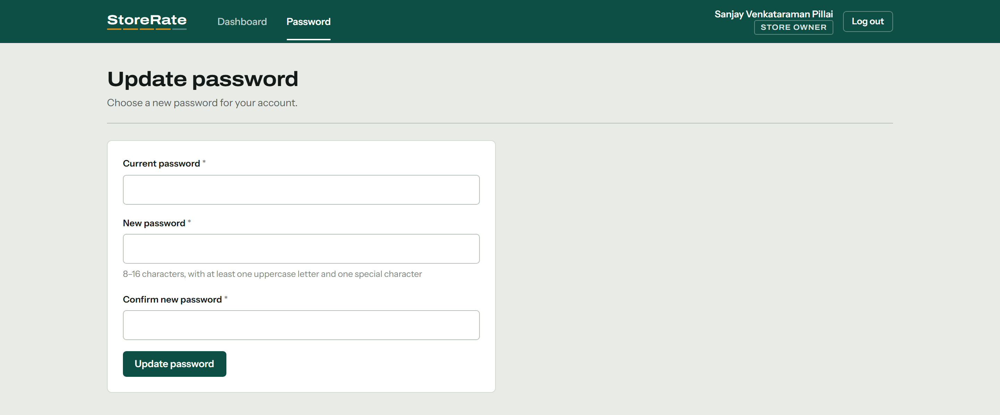

---

## Design

The interface runs on a small token system in `frontend/src/styles.css` rather than a
component library, so every screen resolves from one set of decisions.

**[`docs/DESIGN.md`](docs/DESIGN.md)** is the full record — every decision, the reasoning
behind it, the assumptions it rests on, and what was considered and rejected. The summary
below is the working subset.

**Colour.** Bottle green `#0D4F44` carries navigation and primary actions on a warm
grey-green ground. Two colours are reserved and never used decoratively:

- **saffron `#D9901A` means a rating** — nothing else in the product is saffron;
- **clay `#A3392B` means an error or a destructive control.**

That constraint is load-bearing rather than cosmetic. It is why the role badges separate
by weight and outline instead of by three unrelated hues, and why the active navigation
link is marked with a white rule rather than a coloured pill — saffron was spoken for.

**Type.** Archivo, with its width axis widened, for the wordmark, page titles, table
headings and figures; Instrument Sans for interface text. Every numeric column is set in
tabular figures, so digits line up down the column. Both load from Google Fonts and both
carry a real fallback stack, so a deployment without egress degrades to system faces
rather than breaking.

**The rating meter.** A rating is drawn as five segments filled in proportion to the
score, with the figure beside it — `frontend/src/components/StarRating.jsx`. It replaced
five text `★` glyphs, which sat off their baseline, changed size with the font, and could
not show the difference between 4.14 and 4.80. The partial fill is exact. The interactive
picker keeps five discrete targets and its `radiogroup` semantics, so the mark changed
but the affordance did not.

The same five segments appear beneath the wordmark, and the meter is the reason the
listing tables set a fixed width for a rating count: in a right-aligned column a wider
tally would drag the bars out of line, and the point of the meter is a column you can
read straight down.

**Floor.** Visible keyboard focus on every control, `prefers-reduced-motion` respected,
and a visible label on every input — filter fields carry their name above the box rather
than in a placeholder that disappears as soon as anyone types. Down to 390px no page
scrolls horizontally; wide tables scroll inside their own container instead.

---

## Prerequisites

- **Node.js 18+** (developed on 22.x)
- **PostgreSQL 14+** running locally

If PostgreSQL is not installed yet, this is the native install on Windows. It sets the
postgres superuser password to `postgres`, which is what `backend/.env.example` expects:

```powershell
winget install --id PostgreSQL.PostgreSQL.16 -e --silent --override `
  "--mode unattended --unattendedmodeui none --superpassword postgres --serverport 5432"
```

If you choose a different superuser password, set `PGPASSWORD` in `backend/.env` to match.

---

## Setup

### 1. Backend

```powershell
cd backend
npm install
copy .env.example .env      # then edit PGPASSWORD if yours differs
npm run db:setup            # create database + apply schema + load demo data
npm run dev                 # http://localhost:4000
```

`db:setup` is `db:reset` + `db:seed`. Individually:

| Script               | Effect                                                                  |
| -------------------- | ----------------------------------------------------------------------- |
| `npm run db:migrate` | Apply every migration that has not run yet (safe to run against live data) |
| `npm run db:status`  | List applied and pending migrations, changing nothing                   |
| `npm run db:reset`   | Drop the `public` schema and rebuild it — **deletes every row**          |
| `npm run db:seed`    | Truncate the tables and load the demo dataset                           |
| `npm test`           | Unit tests (`node --test`)                                              |
| `npm run lint`       | ESLint                                                                  |

Migrations live in `backend/src/db/migrations/`, are applied in filename order, and are
recorded in a `schema_migrations` ledger with a checksum. Each runs in its own
transaction behind an advisory lock, so several instances starting at once is safe, and
editing a migration that has already been applied is reported rather than silently
letting two environments drift apart. Adding a column is a new file — never an edit to
an old one, and never a `db:reset`.

`db:seed` and `db:reset` destroy data. The seed refuses to run when `NODE_ENV=production`,
and refuses to truncate a database that already holds rows unless you pass `--force`.

### 2. Frontend

In a second terminal:

```powershell
cd frontend
npm install
npm run dev                 # http://localhost:5173
```

Vite proxies `/api` to `http://localhost:4000`, so the browser talks to a single
origin in development and never hits a CORS preflight.

Open **http://localhost:5173** and sign in with one of the demo accounts below.

---

## Demo accounts

Created by `npm run db:seed`:

| Role                 | Email                         | Password     |
| -------------------- | ----------------------------- | ------------ |
| System Administrator | `admin@storerate.com`         | `Admin@1234` |
| Store Owner          | `sanjay.pillai@storerate.com` | `Test@1234`  |
| Normal User          | `aarav.kulkarni@example.com`  | `Test@1234`  |

All seeded owners and normal users share `Test@1234`. The seed also creates 3 owners,
5 normal users, 5 stores and 17 ratings so the dashboards have something to show.

> These are demo credentials for local development only. Leave `SEED_ADMIN_PASSWORD`
> blank and the seed generates a strong password and prints it once instead of using a
> value anyone can read out of this repository.

---

## Database schema

Three tables and one view — `backend/src/db/migrations/001_initial_schema.sql`:

```
users (id, name, email, password_hash, address, role, password_changed_at, created_at, updated_at)
  ├─ role: ENUM('ADMIN','USER','OWNER')
  ├─ UNIQUE on LOWER(email)              -- Foo@x.com and foo@x.com are one account
  └─ CHECK char_length(name) BETWEEN 20 AND 60

stores (id, name, email, address, owner_id → users.id, created_at, updated_at)
  ├─ UNIQUE on LOWER(email)
  └─ ON DELETE SET NULL                  -- deleting an owner keeps the store and its ratings

ratings (id, user_id → users.id, store_id → stores.id, rating, created_at, updated_at)
  ├─ CHECK (rating BETWEEN 1 AND 5)
  └─ UNIQUE (user_id, store_id)          -- "modify my rating" is an UPDATE, not a new row

store_ratings_summary (view)             -- average_rating + rating_count per store
```

Two decisions worth calling out:

- **The spec's rules are enforced in the schema, not only in the API.** Name length,
  address length and the 1–5 rating range are `CHECK` constraints, so the data stays
  valid even if a bug bypasses the validators.
- **`updated_at` is maintained by a trigger**, not by application code, so it cannot
  drift when a row is updated from a script or a psql session.
- **`password_changed_at` is what makes a password change a revocation.** A JWT is valid
  for its whole lifetime once signed, so without this a user who changed their password
  because they thought it had leaked did not actually end the sessions opened with it.
  Tokens issued before this timestamp are rejected.
- **Search filters are backed by trigram indexes.** `LIKE '%term%'` cannot use a B-tree,
  so those filters were sequential scans. Migration `003` adds GIN indexes over `pg_trgm`,
  and degrades to a notice if the extension is not available on the host.

---

## API

All routes are prefixed with `/api`. Protected routes need `Authorization: Bearer <token>`.

### Auth — all roles

| Method | Route            | Notes                                       |
| ------ | ---------------- | ------------------------------------------- |
| POST   | `/auth/register` | Public signup; always creates a Normal User |
| POST   | `/auth/login`    | Single login for all three roles            |
| GET    | `/auth/me`       | Current session (used on page reload)       |
| PUT    | `/auth/password` | Update password — available to every role   |

### System Administrator — `ADMIN` only

| Method | Route              | Notes                                                             |
| ------ | ------------------ | ----------------------------------------------------------------- |
| GET    | `/admin/dashboard` | Total users, stores, ratings                                      |
| GET    | `/admin/users`     | Filter `name`, `email`, `address`, `role`; sort; paginate         |
| POST   | `/admin/users`     | Create a normal user, admin, or store owner                       |
| GET    | `/admin/users/:id` | Detail; store owners also carry `rating` and their stores         |
| GET    | `/admin/stores`    | Filter `name`, `email`, `address`; sort by name/email/address/rating |
| POST   | `/admin/stores`    | Create a store, optionally assigning an owner                     |
| GET    | `/admin/owners`    | Owner picker for the create-store form; filter `name`/`email`, paginated |

### Stores and ratings — signed-in users

| Method | Route                | Notes                                                         |
| ------ | -------------------- | ------------------------------------------------------------- |
| GET    | `/stores`            | Search `name` / `address`; returns overall rating + your rating |
| GET    | `/stores/:id`        | Single store                                                  |
| PUT    | `/stores/:id/rating` | Submit **or modify** a rating (upsert) — `USER` only          |
| DELETE | `/stores/:id/rating` | Withdraw your rating — `USER` only                            |

### Store Owner — `OWNER` only

| Method | Route              | Notes                                                      |
| ------ | ------------------ | ---------------------------------------------------------- |
| GET    | `/owner/dashboard` | Owned stores, average rating, and a paginated list of the users who rated them |

### Operational

| Method | Route     | Notes                                                                    |
| ------ | --------- | ------------------------------------------------------------------------ |
| GET    | `/health` | Liveness. Touches nothing else, so a slow dependency never restarts the process |
| GET    | `/ready`  | Readiness. `503` while the database is unreachable, so a broken instance leaves rotation |

Every listing endpoint accepts `sortBy`, `sortOrder` (`asc`/`desc`), `page` and `limit`,
and returns `{ data, pagination, sort }`. Sort columns resolve through a server-side
whitelist, so a query string can never reach the `ORDER BY` clause.

---

## Validation rules

Enforced in three places — React (`frontend/src/utils/validation.js`), Express
(`backend/src/validators/index.js`) and PostgreSQL `CHECK` constraints:

| Field    | Rule                                                       |
| -------- | ---------------------------------------------------------- |
| Name     | 20–60 characters                                           |
| Address  | up to 400 characters                                       |
| Password | 8–16 characters, ≥1 uppercase letter, ≥1 special character |
| Email    | standard email format                                      |
| Rating   | integer 1–5                                                |

---

## Verification

An end-to-end smoke test drives the running API across all three roles:

```powershell
cd scripts
npm install
node smoke-test.mjs        # backend must be running
```

73 checks covering login and signup, every validation rule, admin dashboard totals,
filtering on name/email/address/role, ascending *and* descending sort on each listing,
store-owner rating display, store creation, rating submit/modify/delete, role gating in
both directions, password update, and pagination. It also asserts that a malicious
`sortBy` value falls back to the whitelist and leaves the table intact.

The checks are independent of what the database already holds: counts are compared
against a baseline snapshot taken at startup, filters are verified row by row rather
than against fixed totals, and aggregates are cross-checked against the rows they
summarise. Accounts and stores each run creates are tagged with a per-run suffix, so
the script can be run repeatedly without reseeding.

It also covers the hardening: that a password change invalidates the token it was made
with, that bad input (an id past the int4 ceiling, malformed JSON, an oversized body, an
array where a number belongs) comes back as 4xx rather than 500, that a `%` typed into a
filter is matched literally instead of expanding into a wildcard, and that the rate
limiter is mounted.

Rate limits are per-IP and per 15 minutes, and a full run makes far more requests from
one address than a real client would. For repeated runs, start the backend with
`RATE_LIMIT_DISABLED=true` (ignored when `NODE_ENV=production`).

Unit tests cover the pieces where a regression would be silent — password hashing and
the legacy-hash upgrade path, the `ORDER BY` whitelist, LIKE escaping, pagination
clamping, the error-to-status mapping, and each validation rule:

```powershell
cd backend
npm test
npm run lint
```

### Regenerating the screenshots

The images above are captured from the real app, not mocked up:

```powershell
# with both servers running and the database freshly seeded
cd scripts
npx playwright install chromium    # first time only
node capture-screenshots.mjs       # writes docs/screenshots/*.png
```

---

## Production configuration

Every setting is an environment variable; `backend/.env.example` is the full list with
defaults. The ones that matter in production:

| Variable           | Notes                                                                             |
| ------------------ | --------------------------------------------------------------------------------- |
| `JWT_SECRET`       | **Required.** At least 32 characters. `openssl rand -base64 48`                    |
| `DATABASE_URL`     | Takes precedence over the `PG*` variables — the shape managed providers hand out   |
| `PGSSLROOTCERT`    | Your provider's CA bundle, so the database certificate is actually verified        |
| `CORS_ORIGIN`      | Comma-separated list of browser origins. `*` is rejected                           |
| `TRUST_PROXY_HOPS` | Number of proxies in front of the process. **Wrong value breaks rate limiting**    |
| `NODE_ENV`         | `production` — turns the checks below from warnings into refusals to start         |

The process **refuses to boot** rather than starting insecurely: no `JWT_SECRET`, a
secret copied from the example file, a secret under 32 characters, or `CORS_ORIGIN=*`
each stop it with an explanatory message. In development it generates a per-machine
secret into `backend/.dev-secret` (gitignored) instead.

`TRUST_PROXY_HOPS` is a count rather than a boolean on purpose. Trusting the whole
`X-Forwarded-For` chain lets a client prepend addresses and choose its own rate-limit
bucket; the hop count means only the addresses your own infrastructure appended are
believed.

### Operational notes

- **Rate limit counters are in-process.** That is correct for a single instance. Behind a
  load balancer, each replica grants the full budget on its own — move the counters to a
  shared store (`express-rate-limit` takes a Redis-backed `store`) before scaling out.
- **Password hashing is the throughput ceiling.** scrypt runs on the libuv thread pool,
  which defaults to 4 threads. Raising `UV_THREADPOOL_SIZE` to the core count increases
  sign-ins per second, at roughly 32 MB of memory per concurrent hash — budget for
  `UV_THREADPOOL_SIZE × 32 MB` on top of the usual heap.
- **Shutdown is bounded.** `SIGTERM` stops new connections, drains in-flight requests and
  closes the pool, with a forced exit after `SHUTDOWN_TIMEOUT_MS` so a keep-alive
  connection cannot hold the process open until the orchestrator kills it.
- **Every response carries `X-Request-Id`**, echoed in the JSON body on an error and in
  the access log, so a user's report maps to a specific log line.
- **An uncaught exception or unhandled rejection is fatal by design.** The process logs
  it and shuts down cleanly for the supervisor to replace, rather than continuing to
  serve from a state nobody can reason about.

### Continuous integration

`.github/workflows/ci.yml` runs on every push and pull request: lint, unit tests and a
production dependency audit for both packages, then migrations against a real Postgres
service — applied twice, to prove they are idempotent — a seed, and the full smoke
test against a live server.

---

## Project layout

```
backend/
  eslint.config.js
  src/
    config/       env loading + validation, pg connection pool
    db/           migrations/, migrate.js (ledger + advisory lock), seed.js
    middleware/   authenticate / authorize, rate limiters, error handler
    validators/   express-validator rule set
    controllers/  auth, admin, store, rating, owner
    routes/       one route table per area
    utils/        ApiError, password hashing, list-query helpers
  test/           node --test unit tests
frontend/
  eslint.config.js
  src/
    api/          axios instance + token store + error parser
    context/      AuthContext (session, login, logout)
    hooks/        useListing — debounce + sort + paginate
    components/   Layout, AuthShell, DataTable, FilterField, StarRating, Pagination, …
    pages/        auth pages, admin/, user/, owner/
scripts/          smoke-test.mjs, capture-screenshots.mjs
.github/workflows/ci.yml
docs/screenshots/ README images
```

---

## Notable implementation details

- **One rating per user per store.** `INSERT … ON CONFLICT (user_id, store_id) DO UPDATE`
  makes "submit" and "modify" the same request, with no race between them.
- **Tokens are re-checked against the database** on every request, so a role change or a
  deleted account takes effect immediately rather than at token expiry.
- **Login is deliberately vague** — "Invalid email or password" for both an unknown email
  and a wrong password, so the endpoint cannot be used to enumerate registered accounts.
  It is also deliberately *slow* in the same way for both: an unknown address is checked
  against a throwaway hash so the response time does not give away what the message will
  not. Without that, the two answers differed by more than 100 ms.
- **Password hashing runs off the event loop.** `bcryptjs` is pure JavaScript, so every
  comparison burned CPU on the single main thread and concurrent sign-ins starved
  everything else — an unauthenticated caller could degrade the whole API just by
  failing to log in. Node's native `scrypt` runs on the libuv thread pool instead.
  Existing bcrypt hashes still verify, and each one is upgraded transparently the next
  time its owner signs in successfully.
- **Sorting is server-side** across the whole result set, not just the visible page.
- **Filters are debounced** at 300 ms, and any filter change resets to page 1.
- **`BIGINT` and `NUMERIC` are parsed to JS numbers** at the driver level, so counts and
  rating averages arrive as numbers rather than strings in JSON.
